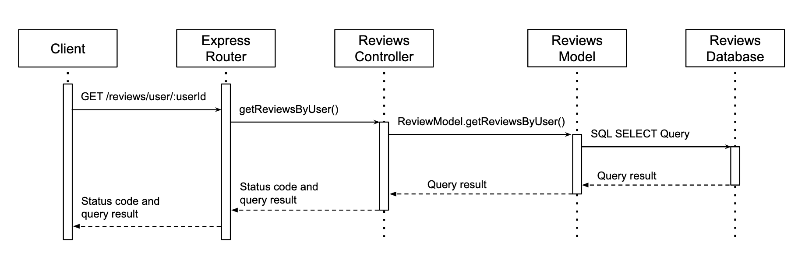

# Game Review Service - Communication Contract

## Overview

The Review Service provides a RESTful API that lets users create, view, and delete video game reviews.

**Base URL**: `http://localhost:4000/`

## Running the Service

```bash
# Install node packages
npm install

# Run the service
npm run dev
```

The service will run on `http://localhost:4000`.

---

## API Endpoints

### 1. Create Review

**Endpoint**: `POST /reviews/create`

**Description**: Creates a new review for a game. Requires userId, gameId, reviewScore (1-10), and review text.

**Parameters**:

- userId (integer): The unique identifier of the user creating the review
- gameId (integer): The unique identifier of the game being reviewed
- reviewScore (integer): The user's rating of the game (must be between 1-10)
- review (string): The text content of the user's review

**Example Request**:

```javascript
const response = await fetch("http://localhost:4000/reviews/create", {
  method: "POST",
  headers: {
    "Content-Type": "application/json",
  },
  body: JSON.stringify({
    userId: 123,
    gameId: 456,
    reviewScore: 8,
    review: "This game was amazing! Great graphics and gameplay.",
  }),
});

const data = await response.json();
console.log(data);
```

**Example Response** (201 Created):

```json
{
  "message": "Review created successfully",
  "reviewId": 19
}
```

**Error Response** (400 Bad Request):

```json
{
  "message": "Missing required fields: userId, gameId, reviewScore, and review are all required"
}
```

**Error Response** (400 Bad Request - Invalid Score):

```json
{
  "message": "Review score must be between 1 and 10"
}
```

---

### 2. Get Reviews By Game

**Endpoint**: `GET /reviews/game/:gameId`

**Description**: Returns all reviews for a given game, including the userId, gameId, reviewScore, and review itself.

**Parameters**: gameId (path parameter, integer): the unique identifier of the game.

**Example Request**:

```javascript
const gameId = 111;
const response = await fetch(`http://localhost:4000/reviews/game/${gameId}`, {
  method: "GET",
  headers: {
    "Content-Type": "application/json",
  },
});

const data = await response.json();
console.log(data);
```

**Example Response** (200 OK):

```json
[
  {
    "userId": 57,
    "gameId": 111,
    "reviewScore": 8,
    "review": "Hollow Knight is fun but hard!"
  },
  {
    "userId": 80,
    "gameId": 111,
    "reviewScore": 3,
    "review": "I didnt like Hollow Knight very much, way too hard."
  }
]
```

**Error Response** (404 not found):

```json
{
    "Game not found."
}
```

---

### 3. Get Reviews By User

**Endpoint**: `GET /reviews/user/:userId`

**Description**: Returns all reviews from a given user, including the userId, gameId, reviewScore, and review itself.

**Parameters**: userId (path parameter, integer): the unique identifier of the user.

**Example Request**:

```javascript
const userId = 57;
const response = await fetch(`http://localhost:4000/reviews/user/${userId}`, {
  method: "GET",
  headers: {
    "Content-Type": "application/json",
  },
});

const data = await response.json();
console.log(data);
```

**Example Response** (200 OK):

```json
[
  {
    "userId": 57,
    "gameId": 111,
    "reviewScore": 8,
    "review": "Hollow Knight is fun but hard!"
  },
  {
    "userId": 57,
    "gameId": 306,
    "reviewScore": 10,
    "review": "RDR2 IS THE BEST GAME EVER!"
  }
]
```

**Error Response** (404 not found):

```json
{
    "User not found."
}
```

---

### 4. Delete Review

**Endpoint**: `POST /reviews/delete/:reviewId`

**Description**: Deletes the review with the given reviewId from the reviews database.

**Parameters**:

- reviewId (path parameter, integer): The unique identifier of the review.

**Example Request**:

```javascript
const reviewId = 4;
const response = await fetch(
  `http://localhost:4000/reviews/delete/${reviewId}`,
  {
    method: "POST",
    headers: {
      "Content-Type": "application/json",
    },
  }
);

const data = await response.json();
console.log(data);
```

**Example Response** (200 OK):

```json
{
  "message": "Delete successful"
}
```

**Error Response** (404 not found):

```json
{
  "message": "Review not found"
}
```

---

## Data Model

| Field         | Type    | Description                           |
| ------------- | ------- | ------------------------------------- |
| `reviewId`    | integer | Unique review identifier              |
| `userId`      | integer | The review author's userId            |
| `gameId`      | integer | The gameId of the game being reviewed |
| `reviewScore` | integer | The user's rating of the game         |
| `reviewTitle` | string  | The text of the user's review         |
| `reviewBody`  | string  | The text of the user's review         |

## UML Diagram


